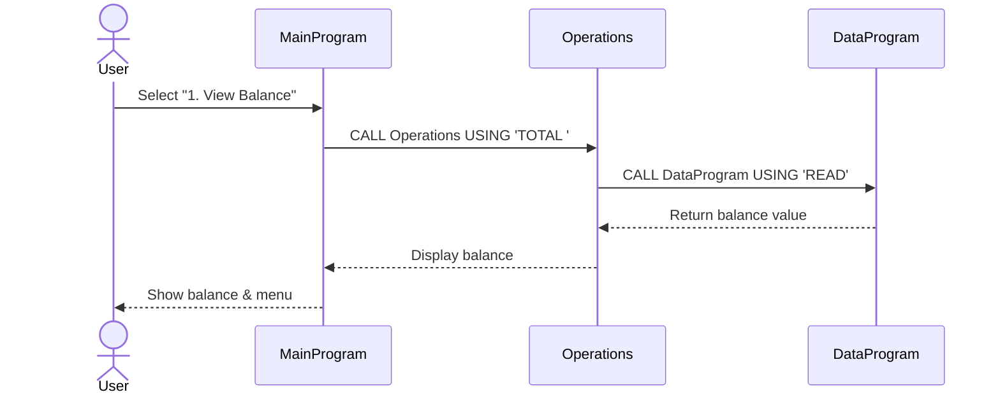
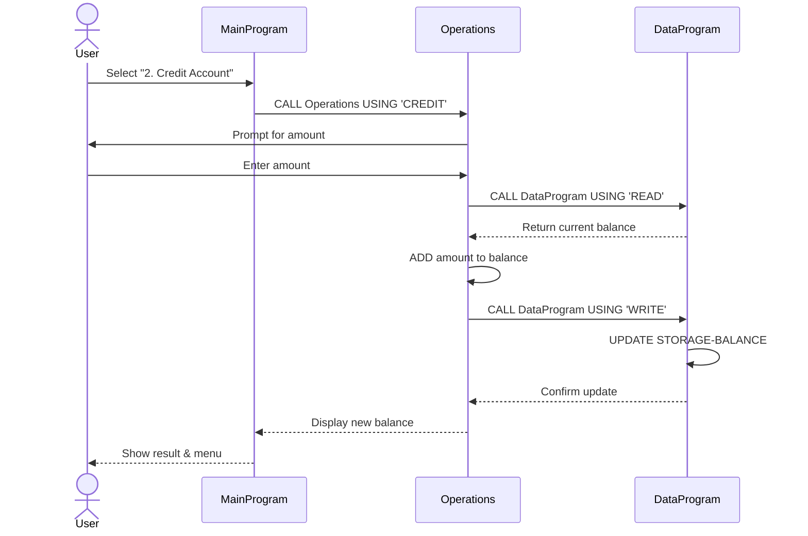
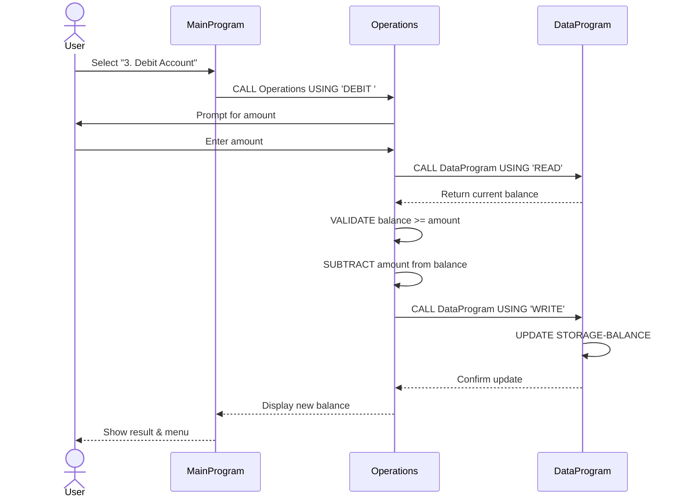
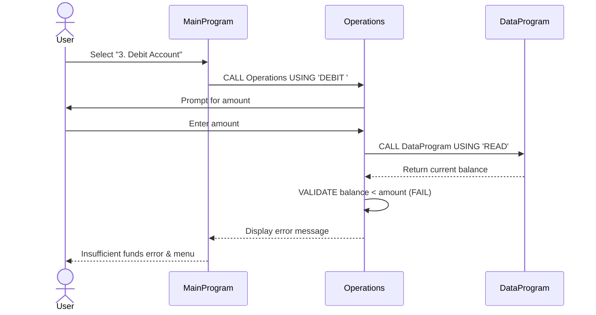

# School Accounting System - COBOL Documentation

## Overview

This system manages student account operations for a school's accounting platform. It provides a menu-driven interface for account management with core operations including balance inquiries, credit transactions, and debit transactions.

## Architecture

The system follows a modular three-tier architecture:

```
┌─────────────────────────────────────────┐
│     Main Program (User Interface)       │
│  - Menu-driven interaction              │
│  - User input handling                  │
└──────────────┬──────────────────────────┘
               │
┌──────────────▼──────────────────────────┐
│   Operations (Business Logic)           │
│  - Account operations                   │
│  - Transaction validation               │
│  - Balance calculations                 │
└──────────────┬──────────────────────────┘
               │
┌──────────────▼──────────────────────────┐
│     Data Program (Data Layer)           │
│  - Balance storage & retrieval          │
│  - Data persistence                     │
└─────────────────────────────────────────┘
```

---

## File Documentation

### 1. **main.cob** - User Interface & Menu Controller

**Purpose:**
- Serves as the main entry point for the accounting system
- Provides an interactive command-line menu for users
- Controls program flow and routes user requests to appropriate operations

**Key Functions:**

| Menu Option | Operation | Description |
|------------|-----------|-------------|
| 1 | View Balance | Retrieves and displays the current account balance |
| 2 | Credit Account | Adds funds to the student account |
| 3 | Debit Account | Withdraws funds from the student account |
| 4 | Exit | Terminates the program |

**Business Logic:**
- Displays a menu loop that continues until user selects "Exit"
- Validates user input (accepts only 1-4)
- Delegates actual account operations to the Operations module
- Rejects invalid menu selections with appropriate error message

**Key Variables:**
- `USER-CHOICE`: Stores the menu selection (numeric value 1-4)
- `CONTINUE-FLAG`: Controls the program loop ('YES' or 'NO')

---

### 2. **operations.cob** - Business Logic Layer

**Purpose:**
- Implements core accounting operations
- Handles transaction processing and validation
- Manages communication between the user interface and data layer

**Key Operations:**

#### TOTAL (View Balance)
- **Function:** Retrieves current account balance
- **Process:** Calls DataProgram with READ operation
- **Output:** Displays current balance to user

#### CREDIT (Add Funds)
- **Function:** Adds specified amount to account balance
- **Process:**
  1. Prompts user for credit amount
  2. Retrieves current balance from DataProgram
  3. Adds amount to balance
  4. Writes updated balance back to storage
- **Output:** Displays new balance after transaction

#### DEBIT (Withdraw Funds)
- **Function:** Withdraws specified amount from account balance
- **Process:**
  1. Prompts user for debit amount
  2. Retrieves current balance from DataProgram
  3. Validates sufficient funds availability
  4. If funds available: subtracts amount and writes new balance
  5. If insufficient funds: rejects transaction
- **Output:** Displays new balance or insufficient funds error

**Business Rules:**

1. **Insufficient Funds Protection**
   - Debits cannot exceed available balance
   - Transaction is rejected if `DEBIT AMOUNT > CURRENT BALANCE`
   - User is notified: "Insufficient funds for this debit."

2. **Balance Accuracy**
   - All transactions read balance before operation
   - Updated balance is written back to storage immediately
   - Prevents concurrent transaction conflicts

**Key Variables:**
- `OPERATION-TYPE`: Type of operation (TOTAL, CREDIT, DEBIT)
- `AMOUNT`: Transaction amount for credit/debit operations
- `FINAL-BALANCE`: Current account balance (PIC 9(6)V99 - 6 digits with 2 decimals)
- `PASSED-OPERATION`: Operation type passed from MainProgram

---

### 3. **data.cob** - Data Storage & Management Layer

**Purpose:**
- Manages persistent storage of the account balance
- Provides read/write interface for balance data
- Ensures centralized control over data access and integrity

**Key Functions:**

#### READ Operation
- **Function:** Retrieves stored balance
- **Parameters:** Operation type = 'READ'
- **Output:** Returns current balance via LINKAGE SECTION

#### WRITE Operation
- **Function:** Updates stored balance
- **Parameters:** Operation type = 'WRITE', new balance value
- **Output:** Stores the provided balance value

**Data Storage:**
- `STORAGE-BALANCE`: The persistent account balance variable
- **Initial Value:** $1000.00 (PIC 9(6)V99)
- **Format:** Fixed-point decimal with 2 decimal places

**Key Variables:**
- `STORAGE-BALANCE`: Holds the master copy of account balance (working storage)
- `OPERATION-TYPE`: Specifies READ or WRITE operation
- `BALANCE`: Balance value passed via linkage (parameter)

---

## Data Format Specifications

### Balance Data Type: PIC 9(6)V99

- **Total Digits:** 8 (6 before decimal, 2 after)
- **Format:** XXXXXX.XX
- **Range:** $0.00 to $999,999.99
- **Usage:** Stores all monetary values in the system

### Operation Types

| Code | Meaning | Module |
|------|---------|--------|
| 'READ' | Retrieve current balance | DataProgram |
| 'WRITE' | Store updated balance | DataProgram |
| 'TOTAL ' | View balance (with space padding) | Operations |
| 'CREDIT' | Add funds to account | Operations |
| 'DEBIT ' | Withdraw funds (with space padding) | Operations |

---

## Business Rules Summary

1. **Initial Balance:** All accounts start with $1000.00

2. **Transaction Validation:**
   - Credit operations: Accept any positive amount
   - Debit operations: Reject if amount exceeds current balance

3. **Data Integrity:**
   - Balance is stored centrally in DataProgram
   - All reads and writes go through DataProgram module
   - Balance reflects all committed transactions

4. **User Experience:**
   - Menu-driven interface for ease of use
   - Clear feedback after each transaction
   - Error messages for invalid operations
   - Graceful exit option

---

## Transaction Flow Example

### Example: Credit $50 to Account

```
1. User selects "2. Credit Account" from menu
   ↓
2. MainProgram calls Operations with 'CREDIT'
   ↓
3. Operations prompts: "Enter credit amount: "
   ↓
4. User enters: 50
   ↓
5. Operations calls DataProgram with 'READ'
   ↓
6. DataProgram returns current balance (e.g., $1000.00)
   ↓
7. Operations calculates: $1000.00 + $50.00 = $1050.00
   ↓
8. Operations calls DataProgram with 'WRITE' and $1050.00
   ↓
9. DataProgram updates STORAGE-BALANCE to $1050.00
   ↓
10. Operations displays: "Amount credited. New balance: 1050.00"
    ↓
11. User returns to menu
```

---

## Maintenance Notes

- **Modular Design:** Each file has a single responsibility, making updates and testing easier
- **Data Centralization:** All balance storage goes through DataProgram, preventing data inconsistencies
- **Linkage Section:** Used for inter-program communication, allowing clean separation of concerns
- **Error Handling:** Includes validation for insufficient funds and invalid menu selections

---

## Application Data Flow Diagram

### Main Flow - View Balance



### Credit Account Flow



### Debit Account Flow - Success Path



### Debit Account Flow - Insufficient Funds



### Data Flow Legend

- **→** : Outgoing call/request
- **--→** : Return value/response

### Key Data Flow Points

1. **User Input Entry:** MainProgram accepts user menu selection
2. **Operation Routing:** MainProgram delegates to Operations module
3. **Balance Retrieval:** Operations requests current balance from DataProgram via READ
4. **Transaction Calculation:** Operations performs arithmetic operations in memory
5. **Balance Update:** Operations writes updated balance to DataProgram via WRITE
6. **Data Persistence:** DataProgram stores balance in STORAGE-BALANCE
7. **User Feedback:** Results are displayed and menu loops until exit

